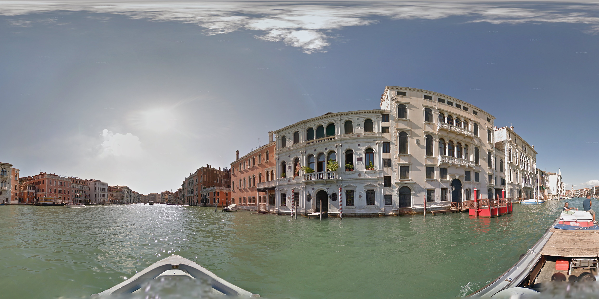
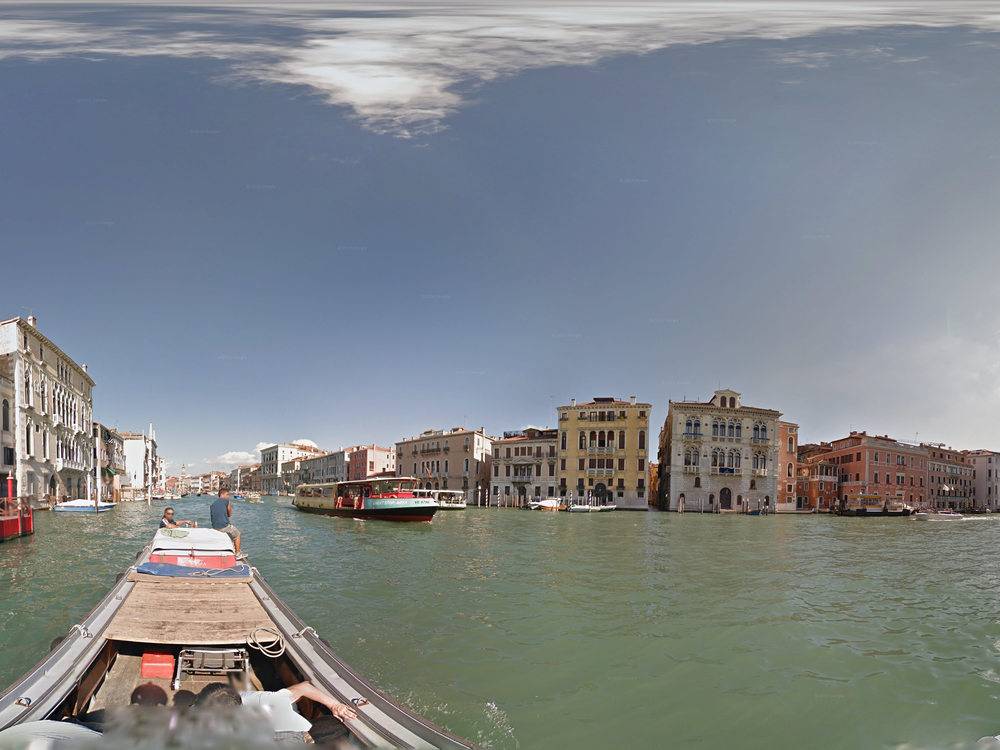
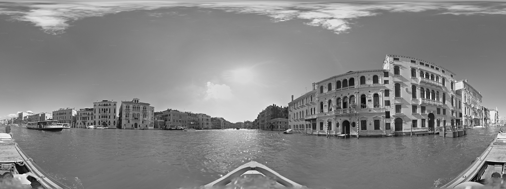
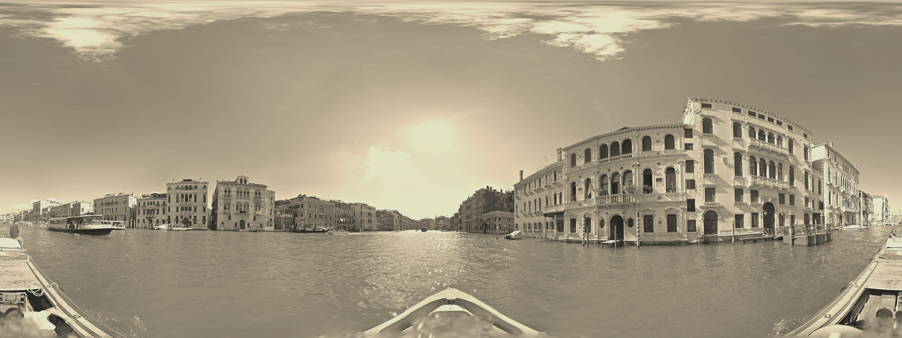
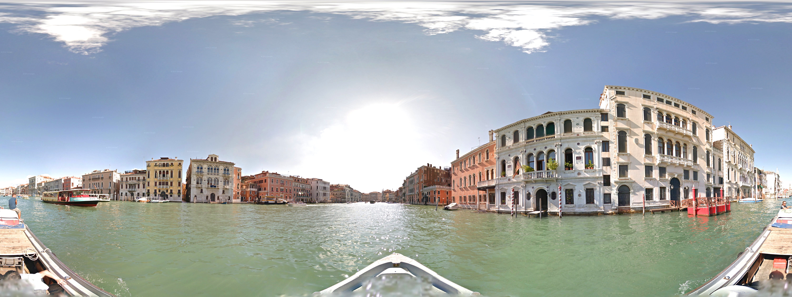

# streetview-dl Examples

This document provides comprehensive examples of `streetview-dl` usage with real commands and their outputs. All examples use the same Venice Street View location for consistency.

## Test Location

**Venice, Italy Canal View**
- **URL**: `https://www.google.com/maps/@45.4360629,12.3305426,3a,60y,236.1h,86.64t/data=...`
- **Coordinates**: 45.4360629, 12.3305426
- **Heading**: 236.1° (Southwest)
- **Pitch**: 86.64° (Looking slightly down)
- **Original FOV**: 60° (zoomed in view)

## Running the Examples

To generate all examples automatically:

```bash
python generate_examples.py
```

This will create an `examples_output/` directory with all the sample images.

## Basic Quality Options

### Low Quality (4K, ~1MB)
```bash
streetview-dl --quality low --output venice_low_quality.jpg "https://maps.url..."
```
- **Resolution**: ~4K (4096×2048)
- **File size**: ~1MB
- **Use case**: Thumbnails, previews, web display


### Medium Quality (8K, ~4MB) - Default
```bash
streetview-dl --quality medium --output venice_medium_quality.jpg "https://maps.url..."
```
- **Resolution**: ~8K (8192×4096)
- **File size**: ~4MB
- **Use case**: Good balance of quality and size


### High Quality (16K, ~10MB)
```bash
streetview-dl --quality high --output venice_high_quality.jpg "https://maps.url..."
```
- **Resolution**: ~16K (16384×8192)
- **File size**: ~10MB
- **Use case**: Maximum detail, printing, professional use


## Field of View Examples

### Narrow 90° View
```bash
streetview-dl --fov 90 --output venice_fov_90deg.jpg "https://maps.url..."
```
- **Use case**: Architectural details, focused composition
- **Result**: Crops to 90° around the URL's heading (236°)


### Standard 180° Half-Panorama
```bash
streetview-dl --fov 180 --output venice_fov_180deg.jpg "https://maps.url..."
```
- **Use case**: Standard wide-angle view
- **Result**: Half the full panorama width


### Wide 270° View
```bash
streetview-dl --fov 270 --output venice_fov_270deg.jpg "https://maps.url..."
```
- **Use case**: Context, environmental documentation
- **Result**: Three-quarters of the full panorama



## Directional Clipping

### Forward-Facing View
```bash
streetview-dl --clip right --output venice_clip_forward.jpg "https://maps.url..."
```
- **Result**: 180° centered on the URL's heading (236°)
- **Use case**: What the camera operator was facing


### Rear-Facing View
```bash
streetview-dl --clip left --output venice_clip_rear.jpg "https://maps.url..."
```
- **Result**: 180° centered on the opposite direction (236° + 180° = 416° = 56°)
- **Use case**: What was behind the camera operator



### Combined FOV + Clipping
```bash
streetview-dl --fov 220 --clip right --output venice_fov220_clip_forward.jpg "https://maps.url..."
```
- **Result**: Clipping overrides FOV, still produces 180° forward view
- **Note**: Shows warning about potentially unexpected results


## Image Filters

### Black and White
```bash
streetview-dl --filter bw --output venice_blackwhite.jpg "https://maps.url..."
```
- **Effect**: Converts to grayscale while maintaining RGB format
- **Use case**: Artistic effect, document scanning



### Sepia Tone
```bash
streetview-dl --filter sepia --output venice_sepia.jpg "https://maps.url..."
```
- **Effect**: Warm brown tones using color matrix transformation
- **Use case**: Vintage aesthetic, historical documentation


### Vintage Effect
```bash
streetview-dl --filter vintage --output venice_vintage.jpg "https://maps.url..."
```
- **Effect**: Sepia + reduced saturation + slight brightness boost
- **Use case**: Nostalgic mood, artistic projects



## Image Adjustments

### Brightness Adjustment
```bash
streetview-dl --brightness 1.3 --output venice_bright.jpg "https://maps.url..."
```
- **Effect**: 30% brighter than original
- **Range**: 0.1 to 3.0 (0.1 = very dark, 3.0 = very bright)



### Contrast Enhancement
```bash
streetview-dl --contrast 1.4 --output venice_high_contrast.jpg "https://maps.url..."
```
- **Effect**: 40% more contrast
- **Range**: 0.1 to 3.0 (0.1 = flat, 3.0 = high contrast)


### Saturation Control
```bash
streetview-dl --saturation 0.6 --output venice_desaturated.jpg "https://maps.url..."
```
- **Effect**: 40% less color saturation
- **Range**: 0.0 to 3.0 (0.0 = grayscale, 3.0 = very saturated)


## Cropping Options

### Bottom Crop
```bash
streetview-dl --crop-bottom 0.75 --output venice_crop_bottom.jpg "https://maps.url..."
```
- **Effect**: Keeps top 75% of image height
- **Use case**: Remove car dashboard, ground clutter, focus on horizon


## Output Formats

### PNG Format
```bash
streetview-dl --format png --output venice_format.png "https://maps.url..."
```
- **Use case**: Lossless compression, transparency support
- **File size**: Larger than JPEG


### WebP Format
```bash
streetview-dl --format webp --output venice_format.webp "https://maps.url..."
```
- **Use case**: Modern web format, good compression
- **File size**: Smaller than JPEG with similar quality


### JPEG Quality Control
```bash
streetview-dl --format jpg --jpeg-quality 85 --output venice_quality85.jpg "https://maps.url..."
```
- **Range**: 1-100 (1 = smallest file/lowest quality, 100 = largest file/highest quality)
- **Default**: 92

## Size Control

### Maximum Width Limit
```bash
streetview-dl --quality high --max-width 4096 --output venice_max_width.jpg "https://maps.url..."
```
- **Effect**: Starts with high quality, then resizes if wider than 4096px
- **Use case**: Ensure compatibility with systems that have size limits


## Metadata Options

### Download with Metadata
```bash
streetview-dl --metadata --output venice_with_metadata.jpg "https://maps.url..."
```
- **Result**: Creates both `venice_with_metadata.jpg` and `venice_with_metadata.json`
- **Metadata includes**: Location, date, copyright, camera parameters


### Metadata Only
```bash
streetview-dl --metadata-only "https://maps.url..."
```
- **Result**: Creates only the JSON metadata file, no image download
- **Use case**: Data collection, location verification

## Complex Combinations

### Professional Photography Setup
```bash
streetview-dl \
  --quality high \
  --fov 200 \
  --clip right \
  --crop-bottom 0.8 \
  --filter vintage \
  --brightness 1.1 \
  --contrast 1.2 \
  --format jpg \
  --jpeg-quality 95 \
  --metadata \
  --output venice_professional.jpg \
  "https://maps.url..."
```

This command demonstrates combining multiple options:
- High quality for maximum detail
- 200° FOV clipped to forward 180°
- Bottom crop to remove distractions
- Vintage filter for aesthetic
- Slight brightness and contrast boost
- High JPEG quality
- Include metadata for documentation


### Web Optimization
```bash
streetview-dl \
  --quality medium \
  --fov 180 \
  --max-width 2048 \
  --format webp \
  --crop-bottom 0.85 \
  --output venice_web_optimized.webp \
  "https://maps.url..."
```

Optimized for web use:
- Medium quality for good size/quality balance
- Standard 180° view
- Width limit for fast loading
- WebP format for smaller files
- Light bottom crop for better composition

## Understanding the Results

### File Naming Convention

The `generate_examples.py` script creates files with descriptive names:
- `venice_low_quality.jpg` - Quality level
- `venice_fov_90deg.jpg` - Field of view setting
- `venice_clip_forward.jpg` - Clipping direction
- `venice_blackwhite.jpg` - Filter applied
- `venice_complex.jpg` - Multiple options combined

### Expected File Sizes

| Quality | Typical Size | Resolution |
|---------|-------------|------------|
| Low | 0.8-1.5 MB | ~4K |
| Medium | 3-5 MB | ~8K |
| High | 8-12 MB | ~16K |

*Actual sizes vary based on image content, filters, and compression settings.*

### Performance Notes

- **High quality**: Takes longer to download (512 tiles vs 32-128)
- **Complex filters**: Add processing time
- **Large FOV**: More image data to process
- **Multiple options**: Cumulative processing time

## Troubleshooting

### Common Issues

1. **"Invalid Google Maps Street View URL"**
   - Ensure the URL contains a panorama ID
   - Check that the URL isn't truncated

2. **"API key error"**
   - Set `GOOGLE_MAPS_API_KEY` environment variable
   - Ensure Map Tiles API is enabled in Google Cloud Console

3. **"No panorama data available"**
   - The panorama may have been removed or restricted
   - Try a different location

4. **Files larger than expected**
   - Use `--max-width` to limit dimensions
   - Lower `--jpeg-quality` for smaller files
   - Use `--quality low` for quick tests

### Getting Help

```bash
streetview-dl --help
streetview-dl --version
streetview-dl --verbose "https://maps.url..."  # Detailed output
```
