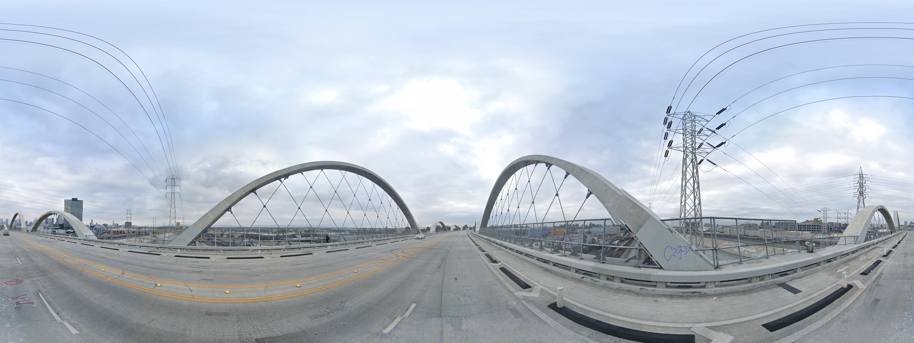

# streetview-dl
[](https://github.com/stiles/streetview-dl/actions/workflows/ci.yml)

Download high-resolution Google Street View panoramas from the command line.

## What it does

Converts Google Maps Street View URLs into full-resolution equirectangular panorama images. Downloads the raw tiles from Google's official Map Tiles API and stitches them together, preserving maximum quality and adding proper 360° metadata.

**New**: Discover and download historical Street View imagery! The tool can automatically find and download multiple time periods for locations with historical captures, perfect for documenting changes over time.

For example, the [6th Street Bridge](https://www.google.com/maps/place/6th+Street+Viaduct/@34.0385329,-118.2281272,3a,75y,358.11h,95.94t/data=!3m8!1e1!3m6!1sCIHM0ogKEICAgIDOtd7zMw!2e10!3e11!6shttps:%2F%2Flh3.googleusercontent.com%2Fgpms-cs-s%2FAB8u6HZ8quaeJMwSfDyz0Wh_3wg2WqgE6odKd6HZiYKuXLvAxJXzdlvnm2q0vOa1Mq6eYZAkT9Js3QlXM2xFawiOFqDX8uWiCFIby7qafoMtBeQcu0CmibR59Dr7IvDNPBdAzBwBXHDx%3Dw900-h600-k-no-pi-5.943789381254604-ya358.112140877387-ro0-fo100!7i12000!8i6000!4m14!1m7!3m6!1s0x80c2c61861a9652d:0x5a206a650885fc61!2s6th+Street+Viaduct!8m2!3d34.0385329!4d-118.2281272!16s%2Fm%2F026m0x8!3m5!1s0x80c2c61861a9652d:0x5a206a650885fc61!8m2!3d34.0385329!4d-118.2281272!16s%2Fm%2F026m0x8?entry=ttu&g_ep=EgoyMDI1MDkxNy4wIKXMDSoASAFQAw%3D%3D) in Los Angeles: 



> **More:** See the tool in action with these [examples](EXAMPLES.md) or read a [Medium post](https://medium.com/@stiles/download-high-resolution-google-street-view-panoramas-in-the-command-line-a800ef16f270) about it. 

## Installation

```bash
# From PyPI
pip install streetview-dl

# From source
git clone https://github.com/yourusername/streetview-dl
cd streetview-dl
pip install -e .
```

## Quick start

```bash
# Basic download
streetview-dl "https://www.google.com/maps/@33.99,-118.40,3a,75y,148h,98t/..."

# Specify output file
streetview-dl --output beach-pano.jpg "https://maps.url..."

# Lower quality for smaller files
streetview-dl --quality medium "https://maps.url..."

# Black and white filter
streetview-dl --filter bw "https://maps.url..."
```

## Understanding Street View URLs

Google Maps Street View URLs contain parameters that determine the viewing perspective. Understanding these helps you use `--fov` and `--clip` options effectively.

Example URL breakdown:
```
https://www.google.com/maps/@34.1309317,-118.4732331,3a,75y,32.27h,103.53t/data=...
                              │          │            │  │   │      │
                              │          │            │  │   │      └─ Pitch/tilt angle
                              │          │            │  │   └─ Heading (yaw) in degrees  
                              │          │            │  └─ Field of view in degrees
                              │          │            └─ Street View mode token
                              │          └─ Longitude
                              └─ Latitude
```

### Key parameters for image processing:

- **`32.27h`** - **Heading/Yaw** (32.27°): Compass direction the camera faces
  - 0°/360° = North, 90° = East, 180° = South, 270° = West
  - Used by `--clip left|right` to determine forward/rear direction
  
- **`75y`** - **Field of View** (75°): How much the camera "sees" horizontally  
  - Smaller values = zoomed in, larger = zoomed out
  - **Note**: URL FOV is different from `--fov` - URL FOV is the original view, `--fov` crops the downloaded panorama
  
- **`103.53t`** - **Pitch/Tilt** (103.53°): Up/down angle of camera
  - Lower values look up, higher values look down
  - Affects what you see when using `--crop-bottom`

### How URL parameters relate to options:

```bash
# URL shows heading 32° - clip to forward-facing 180°
streetview-dl --clip right "https://maps.url.../32.27h/..."

# URL shows heading 32° - clip to rear-facing 180° (32° + 180° = 212°)  
streetview-dl --clip left "https://maps.url.../32.27h/..."

# Crop 120° around the URL's heading direction (32°)
streetview-dl --fov 120 "https://maps.url.../32.27h/..."

# Combine: 200° crop in the forward direction from URL heading
streetview-dl --fov 200 --clip right "https://maps.url.../32.27h/..."
```

## Setup

### Get a Google Maps API key

1. Go to [Google Cloud Console](https://console.cloud.google.com/)
2. Create a new project or select existing
3. Enable the "Map Tiles API"
4. Create credentials → API Key
5. Set up billing (required for Map Tiles API)

### Configure authentication

Choose one method:

```bash
# Environment variable (recommended)
export GOOGLE_MAPS_API_KEY="your_api_key_here"

# CLI argument
streetview-dl --api-key "your_key" "https://maps.url..."

# Config file
streetview-dl --configure
```

## Options

### Quality and output
```bash
--quality high|medium|low    # Default: medium (8K resolution, good balance)
--output filename.jpg        # Custom output filename
--format jpg|png|webp        # Image format (default: jpg)
--jpeg-quality 85            # JPEG compression (1-100)
--max-width 8192             # Resize if larger
```

### Image processing
```bash
--fov 180                    # Field of view in degrees (60-360, crops around viewing direction)
--filter bw|sepia|vintage    # Apply artistic filters
--brightness 1.2             # Adjust brightness
--contrast 1.1               # Adjust contrast
--saturation 0.8             # Adjust color saturation
--clip left|right|none       # Clip to 180° half relative to view yaw (overrides FOV if < 180°)
--crop-bottom 0.75           # Keep top fraction of height (default: 0.75 to remove car blur)
--no-crop                    # Disable default bottom cropping (keep full image)
```

### Metadata and batch processing
```bash
--metadata                   # Save metadata as JSON
--metadata-only              # Extract metadata without downloading
--historical                 # Discover and list historical imagery dates for this location
--historical-download        # Download all available historical images for this location
--historical-max-depth 7     # Search depth for historical discovery (1-10, default: 7)
--historical-max-panoramas 200  # Max panoramas to check (50-500, default: 200)
--batch urls.txt             # Process multiple URLs
--output-dir ./panoramas/    # Output directory for batch
```

### Advanced
```bash
--no-xmp                     # Skip 360° metadata embedding
--timeout 30                 # Request timeout seconds
--retries 3                  # HTTP retry attempts
--backoff 0.5                # Retry backoff factor
--concurrency 0              # Parallel tile workers (0=auto by CPU/quality)
--configure                  # Configure API key interactively
--verbose                    # Verbose output
```

## Usage

You can run the CLI on a single URL or a batch file.

```bash
streetview-dl 'https://www.google.com/maps/place/...'
```

### Options of interest
- `--accent-color [cyan|yellow]`: changes terminal accent color
- `--timeout SECONDS`: request timeout (default 30)
- `--retries N`: HTTP retry attempts for transient errors (default 3)
- `--backoff SECONDS`: exponential backoff factor between retries (default 0.5)

## Examples

### Basic usage
```bash
# Download full resolution panorama
streetview-dl "https://www.google.com/maps/@40.7589,-73.9851,3a,75y,200h,90t/data=..."
```

### Quality options
```bash
# High quality for maximum detail (16K resolution, ~10MB)
streetview-dl --quality high "https://maps.url..."

# Default medium quality (8K resolution, ~4MB, good balance)
streetview-dl "https://maps.url..."

# Low quality for thumbnails (4K resolution, ~1MB)
streetview-dl --quality low "https://maps.url..."
```

### Field of view examples
```bash
# Narrow 90° view for architectural details
streetview-dl --fov 90 "https://maps.url..."

# Standard 180° half-panorama
streetview-dl --fov 180 "https://maps.url..."

# Wide 270° view for context
streetview-dl --fov 270 "https://maps.url..."

# Combine with quality for detailed crops
streetview-dl --quality high --fov 120 "https://maps.url..."
```

### Artistic filters
```bash
# Black and white
streetview-dl --filter bw "https://maps.url..."

# Vintage sepia tone
streetview-dl --filter sepia --brightness 1.1 --contrast 0.9 "https://maps.url..."
```

### Framing and cropping
```bash
# Basic download (automatically removes bottom 25% car blur)
streetview-dl "https://maps.url..."

# Crop to specific field of view around the viewing direction
streetview-dl --fov 180 "https://maps.url..."

# Clip to forward-facing 180° half (ignores --fov if smaller than 180°)
streetview-dl --clip right "https://maps.url..."

# Clip to rear-facing 180° half
streetview-dl --clip left "https://maps.url..."

# Combine FOV cropping with directional clipping (FOV should be ≥ 180°)
streetview-dl --fov 220 --clip right "https://maps.url..."

# Keep full image height (disable default car blur removal)
streetview-dl --no-crop "https://maps.url..."

# Custom bottom crop (more aggressive than default)
streetview-dl --crop-bottom 0.6 "https://maps.url..."

# Combine all framing options
streetview-dl --fov 200 --clip right --crop-bottom 0.8 "https://maps.url..."
```

> 💡 **Want to see examples?** Check out [EXAMPLES.md](EXAMPLES.md) for comprehensive CLI usage examples, or run `python generate_examples.py` to create sample outputs. 

### Batch processing
```bash
# Create urls.txt with one URL per line, then:
streetview-dl --batch batch_urls.txt --output-dir ./example_panoramas/
```

### Metadata extraction
```bash
# Get comprehensive metadata including camera orientation, address, and more
streetview-dl --metadata-only "https://maps.url..."

# Save both image and metadata
streetview-dl --metadata "https://maps.url..."
```

#### Available metadata fields
The `--metadata` and `--metadata-only` flags extract comprehensive information from Google's Street View Tile API:

**Location & Coordinates:**
- `lat`, `lng` - Current panorama coordinates
- `original_lat`, `original_lng` - Original capture coordinates  
- `original_elevation_above_egm96` - Original elevation in meters

**Camera Orientation:**
- `heading` - Compass direction (0-360°)
- `tilt` - Camera pitch angle
- `roll` - Camera roll rotation
- `url_yaw`, `url_pitch` - Viewing angles from URL
- `url_fov` - Field of view from URL (e.g., 75°)
- `url_mode_token` - Street View mode (e.g., "3a")
- `url_date` - Date from URL if present (YYYYMMDDTHHMMSS format)

**Image Details:**
- `pano_id` - Unique panorama identifier
- `image_width`, `image_height` - Full panorama dimensions
- `tile_width`, `tile_height` - Individual tile dimensions
- `imagery_type` - "indoor" or "outdoor"

**Capture Information:**
- `date` - Capture date (YYYY-MM format)
- `copyright_info` - Attribution text
- `address_components` - Structured address data
- `links` - Connected panoramas with headings
- `report_problem_link` - Problem reporting URL

### Historical imagery discovery

`streetview-dl` can discover and download historical Street View imagery for locations that have multiple capture dates. The tool uses enhanced link traversal to find different time periods available at a location.

```bash
# Discover available historical dates for a location
streetview-dl --historical "https://maps.url..."

# Download all available historical panoramas for a location
streetview-dl --historical-download "https://maps.url..."

# More aggressive search (higher API usage but finds more dates)
streetview-dl --historical --historical-max-depth 10 --historical-max-panoramas 500 "https://maps.url..."

# Combine with other options for historical downloads
streetview-dl --historical-download --quality high --filter bw "https://maps.url..."
```

**Advanced options:**
- `--historical-max-depth N`: Search depth (1-10, default: 7) - higher finds more dates but slower
- `--historical-max-panoramas N`: Max panoramas to check (50-500, default: 200) - higher limit for thorough search

#### Example: The Karate Kid apartment

The [South Seas Apartments](https://www.google.com/maps/place/South+Seas+Apartments/@34.2084337,-118.55223,3a,75y,20.27h,80.43t/data=!3m8!1e1!3m6!1s7Dpn21NUjyv7RcROh2qzng!2e0!5s20220901T000000!6shttps:%2F%2Fstreetviewpixels-pa.googleapis.com%2Fv1%2Fthumbnail%3Fcb_client%3Dmaps_sv.tactile%26w%3D900%26h%3D600%26pitch%3D9.570344560327754%26panoid%3D7Dpn21NUjyv7RcROh2qzng%26yaw%3D20.268392957001552!7i16384!8i8192!4m6!3m5!1s0x80c29bc3bd172b07:0xca2e532c1b67608b!8m2!3d34.2085531!4d-118.5522013!16s%2Fg%2F11ghtdt49z?entry=ttu&g_ep=EgoyMDI1MTAxNC4wIKXMDSoASAFQAw%3D%3D) in Reseda, CA (Daniel LaRusso's apartment from The Karate Kid) has multiple historical captures:

```bash
# Discover historical dates at this famous location
streetview-dl --historical "https://www.google.com/maps/place/South+Seas+Apartments/@34.2084337,-118.55223,3a,75y,1.07h,79.39t/data=!3m8!1e1!3m6!1s7Dpn21NUjyv7RcROh2qzng!2e0!5s20220901T000000..."

# Download all historical versions
streetview-dl --historical-download --quality medium "https://maps.url..."
```

This discovers and downloads panoramas from multiple time periods:
- **2022-09**: Most recent capture
- **2021-03**: Mid-pandemic view  
- **2018-05**: Earlier historical view

See `examples/historical-karate-kid-apartment/` for the actual downloaded images.

#### Limitations

**Important**: Historical discovery has inherent limitations due to Google's API constraints:

- **Partial discovery**: Typically finds **3-6 time periods** (Google's web interface may show 10+ periods)
- **API limitations**: Google's Map Tiles API doesn't expose the complete historical timeline
- **Recent bias**: Finds dates from approximately **2015-present** reliably; older imagery (pre-2015) is often not discoverable
- **Variable results**: Locations with frequent recapture (major streets) yield better results than rarely-captured areas
- **No guaranteed coverage**: Not all locations with "See more dates" in Google Maps will be fully discoverable

**How it works:**
The tool searches for historical imagery by:
1. Starting at your location with multiple search radii (25m, 50m, 100m, 150m)
2. Following spatial links (forward/back/sideways connections between panoramas)
3. Traversing up to 7 levels deep by default (configurable to 10 with `--historical-max-depth`)
4. Prioritizing exploration of older dates when found

**Performance:**
- Default settings (depth=7, 200 panoramas): ~15-40 API calls, finds 3-6 dates
- Aggressive settings (depth=10, 500 panoramas): ~30-100 API calls, finds 4-8 dates

The tool uses advanced techniques to maximize discovery within API constraints, but cannot access Google's complete internal historical database. For comprehensive historical analysis, consider using the dates found here as a representative sample.

## Output

Downloads create equirectangular panorama images with:
- Full resolution (typically 16384×8192 pixels with the "high" flag)
- Proper XMP metadata for 360° photo viewers
- Geographic and temporal metadata when available
- Copyright and attribution information

Files are compatible with:
- Facebook 360° photos
- VR headsets and viewers
- Google Photos spherical view
- Any software supporting equirectangular panoramas

## API limits and costs

Uses Google's official [Map Tiles API](https://developers.google.com/maps/documentation/tile):
- Requires billing enabled
- No charge for less than 100k requests per month
- **Quality impacts number of requests**: `high` = 512 tiles, `medium` = 128 tiles, `low` = 32 tiles
  - Defaults to `medium`
- Virtually free and cheaper than [commercial alternatives](https://svd360.com/)
- Respects Google's terms of service

## Requirements

- Python 3.8+
- Google Maps API key **with Map Tiles API enabled**

## License

[MIT License](LICENSE.md)

## Contributing

Issues and pull requests welcome!
