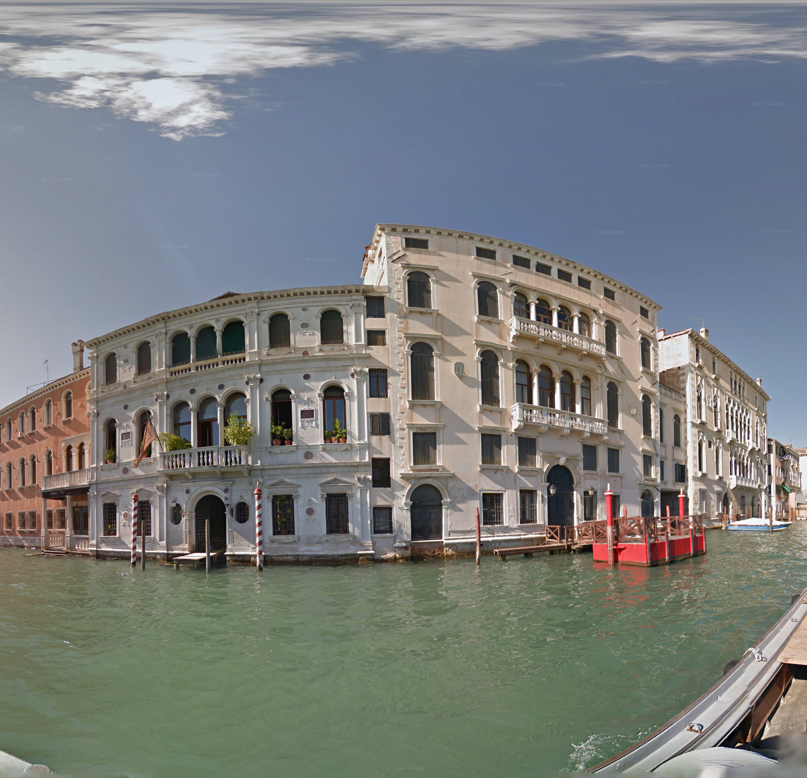

# streetview-dl
[](https://github.com/stiles/streetview-dl/actions/workflows/ci.yml)

Download high-resolution Google Street View panoramas from the command line.

## What it does

Converts Google Maps Street View URLs into full-resolution equirectangular panorama images. Downloads the raw tiles from Google's official Map Tiles API and stitches them together, preserving maximum quality and adding proper 360° metadata.

For example, the [Sixth Street Viaduct](https://www.google.com/maps/place/6th+Street+Viaduct/@34.0385329,-118.2281272,3a,75y,358.11h,95.94t/data=!3m8!1e1!3m6!1sCIHM0ogKEICAgIDOtd7zMw!2e10!3e11!6shttps:%2F%2Flh3.googleusercontent.com%2Fgpms-cs-s%2FAB8u6HZ8quaeJMwSfDyz0Wh_3wg2WqgE6odKd6HZiYKuXLvAxJXzdlvnm2q0vOa1Mq6eYZAkT9Js3QlXM2xFawiOFqDX8uWiCFIby7qafoMtBeQcu0CmibR59Dr7IvDNPBdAzBwBXHDx%3Dw900-h600-k-no-pi-5.943789381254604-ya358.112140877387-ro0-fo100!7i12000!8i6000!4m14!1m7!3m6!1s0x80c2c61861a9652d:0x5a206a650885fc61!2s6th+Street+Viaduct!8m2!3d34.0385329!4d-118.2281272!16s%2Fm%2F026m0x8!3m5!1s0x80c2c61861a9652d:0x5a206a650885fc61!8m2!3d34.0385329!4d-118.2281272!16s%2Fm%2F026m0x8?entry=ttu&g_ep=EgoyMDI1MDkxNy4wIKXMDSoASAFQAw%3D%3D) in Los Angeles: 


## Installation

```bash
# From PyPI (coming soon)
pip install streetview-dl

# From source (current)
git clone https://github.com/yourusername/streetview-dl
cd streetview-dl
pip install -e .
```

## Quick start

```bash
# Basic download
streetview-dl "https://www.google.com/maps/@33.99,-118.40,3a,75y,148h,98t/..."

# Specify output file
streetview-dl --output beach-pano.jpg "https://maps.url..."

# Lower quality for smaller files
streetview-dl --quality medium "https://maps.url..."

# Black and white filter
streetview-dl --filter bw "https://maps.url..."
```

## Setup

### Get a Google Maps API key

1. Go to [Google Cloud Console](https://console.cloud.google.com/)
2. Create a new project or select existing
3. Enable the "Map Tiles API"
4. Create credentials → API Key
5. Set up billing (required for Map Tiles API)

### Configure authentication

Choose one method:

```bash
# Environment variable (recommended)
export GOOGLE_MAPS_API_KEY="your_api_key_here"

# CLI argument
streetview-dl --api-key "your_key" "https://maps.url..."

# Config file
streetview-dl --configure
```

## Options

### Quality and output
```bash
--quality high|medium|low    # Default: medium (8K resolution, good balance)
--output filename.jpg        # Custom output filename
--format jpg|png|webp        # Image format (default: jpg)
--jpeg-quality 85            # JPEG compression (1-100)
--max-width 8192             # Resize if larger
```

### Image processing
```bash
--filter bw|sepia|vintage    # Apply artistic filters
--brightness 1.2             # Adjust brightness
--contrast 1.1               # Adjust contrast
--saturation 0.8             # Adjust color saturation
--clip left|right|none       # Clip to 180° half relative to view yaw
--crop-bottom 0.75           # Keep top fraction of height (e.g., 0.75)
```

### Metadata and batch processing
```bash
--metadata                   # Save metadata as JSON
--metadata-only              # Extract metadata without downloading
--batch urls.txt             # Process multiple URLs
--output-dir ./panoramas/    # Output directory for batch
```

### Advanced
```bash
--no-xmp                     # Skip 360° metadata embedding
--timeout 30                 # Request timeout seconds
--retries 3                  # HTTP retry attempts
--backoff 0.5                # Retry backoff factor
--concurrency 0              # Parallel tile workers (0=auto by CPU/quality)
--configure                  # Configure API key interactively
--verbose                    # Verbose output
```

## Usage

You can run the CLI on a single URL or a batch file.

```bash
streetview-dl 'https://www.google.com/maps/place/...'
```

### Options of interest
- `--accent-color [cyan|yellow]`: changes terminal accent color
- `--timeout SECONDS`: request timeout (default 30)
- `--retries N`: HTTP retry attempts for transient errors (default 3)
- `--backoff SECONDS`: exponential backoff factor between retries (default 0.5)

## Examples

### Basic usage
```bash
# Download full resolution panorama
streetview-dl "https://www.google.com/maps/@40.7589,-73.9851,3a,75y,200h,90t/data=..."
```

### Quality options
```bash
# High quality for maximum detail (16K resolution, ~10MB)
streetview-dl --quality high "https://maps.url..."

# Default medium quality (8K resolution, ~4MB, good balance)
streetview-dl "https://maps.url..."

# Low quality for thumbnails (4K resolution, ~1MB)
streetview-dl --quality low "https://maps.url..."
```

### Artistic filters
```bash
# Black and white
streetview-dl --filter bw "https://maps.url..."

# Vintage sepia tone
streetview-dl --filter sepia --brightness 1.1 --contrast 0.9 "https://maps.url..."
```

### Framing and cropping
```bash
# Keep only the 180° you are facing (uses yaw from the URL)
streetview-dl --fov 180 --clip right "https://maps.url..."

# Keep the opposite half
streetview-dl --fov 180 --clip left "https://maps.url..."

# Remove the bottom 25% to avoid car blur
streetview-dl --crop-bottom 0.75 "https://maps.url..."

# Combine framing and bottom crop
streetview-dl --fov 180 --clip right --crop-bottom 0.75 "https://maps.url..."
```

#### Framing examples (Venice)

100°, 180°, 220°, 280°, and the full panorama captured from the same spot in Venice:





Command pattern used:

```bash
streetview-dl 'https://www.google.com/maps/@45.4360629,12.3305426,3a,60y,236.1h,86.64t/data=!3m7!1e1!3m5!1sjGaYvr31o-KsarHZtXbc5w!2e0!6shttps:%2F%2Fstreetviewpixels-pa.googleapis.com%2Fv1%2Fthumbnail%3Fcb_client%3Dmaps_sv.tactile%26w%3D900%26h%3D600%26pitch%3D3.357981416541378%26panoid%3DjGaYvr31o-KsarHZtXbc5w%26yaw%3D236.10458342884988!7i13312!8i6656?entry=ttu' \
  --quality high --fov <100|180|220|280> --clip right --crop-bottom 0.75
```

### Batch processing
```bash
# Create urls.txt with one URL per line, then:
streetview-dl --batch batch_urls.txt --output-dir ./example_panoramas/
```

### Metadata extraction
```bash
# Get location data, capture date, copyright info
streetview-dl --metadata-only "https://maps.url..."

# Save both image and metadata
streetview-dl --metadata "https://maps.url..."
```

## Output

Downloads create equirectangular panorama images with:
- Full resolution (typically 16384×8192 pixels with the "high" flag)
- Proper XMP metadata for 360° photo viewers
- Geographic and temporal metadata when available
- Copyright and attribution information

Files are compatible with:
- Facebook 360° photos
- VR headsets and viewers
- Google Photos spherical view
- Any software supporting equirectangular panoramas

## API limits and costs

Uses Google's official [Map Tiles API](https://developers.google.com/maps/documentation/tile):
- Requires billing enabled
- No charge for less than 100k requests per month
- **Quality impacts number of requests**: `high` = 512 tiles, `medium` = 128 tiles, `low` = 32 tiles
- Virtually free and cheaper than [commercial alternatives](https://svd360.com/)
- Respects Google's terms of service

## Requirements

- Python 3.8+
- Google Maps API key **with Map Tiles API enabled**

## License

[MIT License](LICENSE.md)

## Contributing

Issues and pull requests welcome at the [GitHub repository](https://github.com/stiles/streetview-dl).
